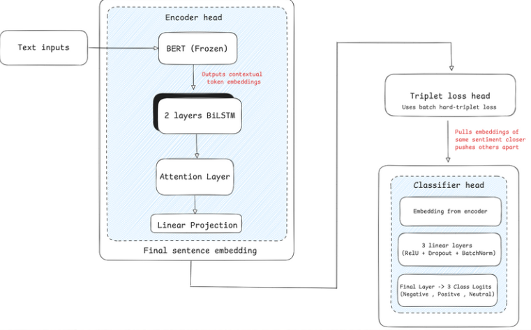
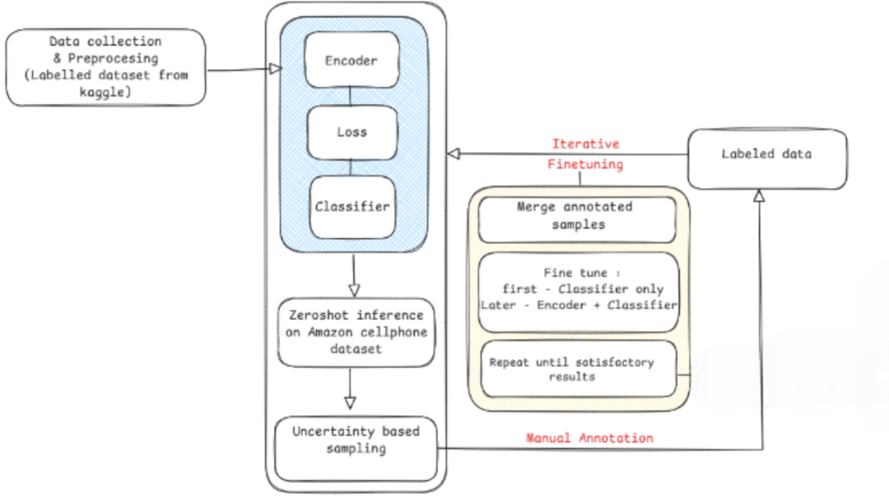

# Sentiment Analysis with Metric Learning

This repository contains a deep learning framework for **fine-grained sentiment classification**.  
The model combines contextual embeddings, sequential modeling, attention for interpretability, and metric-based learning to achieve robust performance under low-supervision settings.  

---

## Key Features

- **BERT Encoder**: Pretrained BERT-base to generate contextual word and sentence embeddings.  
- **BiLSTM Layer**: Captures sequential dependencies in text.  
- **Attention Mechanism**: Focuses on sentiment-relevant tokens, improving interpretability.  
- **Projection Head + Triplet Loss**: Structures the embedding space for better class separation.  
- **Classification Head**: Multi-layer perceptron (MLP) for predicting sentiment labels.  

---

## Architecture

The network jointly optimizes:  
- **Cross-Entropy Loss** → improves classification accuracy.  
- **Triplet Loss** → enforces discriminative embeddings for better generalization.  

---

## Training Strategy

1. **Joint Optimization**  
   - Classification loss for sentiment prediction.  
   - Triplet loss for embedding regularization.  

2. **Confidence-Driven Sampling**  
   - Actively selects uncertain samples for annotation.  

3. **Domain Adaptation**  
   - Fine-tuned on Amazon reviews with frozen BERT encoder.  
   - Classification loss weighted higher (`α = 2.0`) for accuracy.  

---

## Applications

- **Fine-grained sentiment analysis** on product reviews.  

- Works well under **limited supervision**.  

